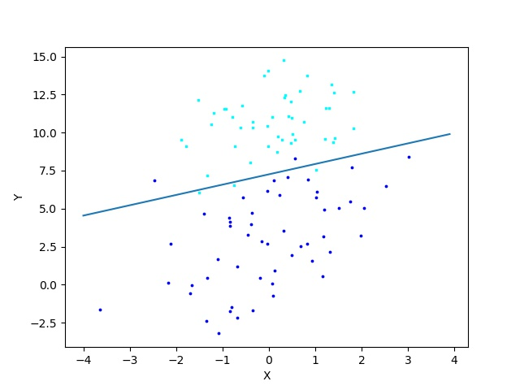
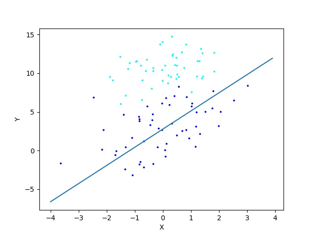

# Machine-Learning
``
机器学习实战 Machine Learning in Action
``
# Decision Tree
`对于基于树的算法，首先应当了解分支或生成子节点的依据是什么，决策树也一样。决策树算法通过度量使用哪一个属性可以最大化区分数据集中的记录，作为分支选择的依据。一般有信息增益、增益率、基尼指数三种划分依据。`
## 划分选择
### 信息增益
`待填`
### 增益率
`待填`
### 基尼指数
`待填`
## 剪枝处理
`待填`
### 预剪枝
`待填`
### 后剪枝
`待填`
# Naive Bayes
`巨坑`

# Logistic Regression

### 批量梯度下降[BGD]

### 随机梯度下降[SGD]

# K-Nearest Neighbour (KNN)
`对于带标记数据集dataSet，和未标记数据X，计算X与dataSet中每一个记录的距离，将这些距离从小到大排序，统计距离最小的K个有标签数据中每种标记类别的次数，将出现次数最多的一个类别作为未标记数据X的预测`
# Support Vector Machine (SVM)
`又一个天坑`
# K-Means
## 距离度量
`神坑`

# FP树(频繁模式树)
`统计并从大到小排序所有出现的模式，依据模式出现的频度，对每一个事务/记录中出现的模式进行排序，并按照前缀树的思想构造FP树，最常出现的模式总是靠近根结点，从根节点到每一个节点的路径都是一个模式，该节点计数代表该模式出现的次数`